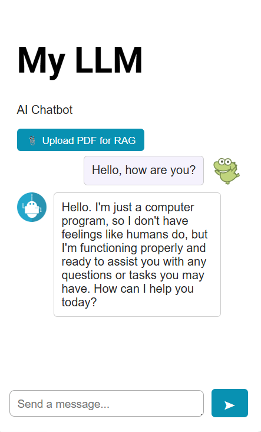

# LLM Application Chatbot

A publicly deployed AI chatbot powered by DeepSeek R1 (70B) via the Groq API, hosted on Netlify. Supports standard multi-turn conversation as well as **Retrieval-Augmented Generation (RAG)** — upload a PDF and the chatbot answers questions grounded in its content.

**Live app:** [https://ai-powered-chat.netlify.app/](https://ai-powered-chat.netlify.app/)

## Screenshots



## Tools and Technologies Used

- **Node.js 18** -- serverless functions (Netlify Functions)
- **Groq API** -- LLM inference (DeepSeek R1 70B)
- **PDF.js** (v3.11, bundled locally) -- client-side PDF text extraction; runs entirely in the browser, no server dependency
- **Netlify** -- hosting, serverless function runtime, and continuous deployment
- **HTML5 / CSS3 / JavaScript (ES6+)** -- frontend
- **Git and GitHub**

## Key Features

- Publicly accessible browser-based chatbot interface
- **PDF RAG pipeline** -- upload a PDF, ask questions about it; answers are grounded in the document content
- PDF text is extracted entirely in the browser (PDF.js) -- no server-side PDF library needed
- Single Groq API call per RAG query -- no database, no embeddings service, no cold-start delays
- Multi-turn conversation memory (last N exchanges sent with each request)
- API keys secured server-side, never exposed to the browser

## How It Works

### Regular Chat

`script.js` sends the user message and conversation history as a POST to `/.netlify/functions/chatbot`, which calls the Groq API and returns the AI reply.

### PDF RAG Pipeline

| Step | What happens |
|---|---|
| **1. Select PDF** | User picks a PDF file in the browser |
| **2. Extract** | PDF.js (bundled at `/static/pdf.min.js`) extracts all text client-side -- no upload needed |
| **3. Store locally** | The extracted text is kept in a JavaScript variable in the browser |
| **4. Query** | User types a question; browser POSTs `{ prompt, pdfText }` to `rag_query` |
| **5. Answer** | The Netlify function injects the full document text as context into a Groq prompt and returns the answer |

No database, no embedding model, no third-party services beyond Groq.

### Serverless Functions

| File | Route | Purpose |
|---|---|---|
| `netlify/functions/chatbot.js` | `/.netlify/functions/chatbot` | Multi-turn chat via Groq |
| `netlify/functions/rag_query/rag_query.js` | `/.netlify/functions/rag_query` | Sends PDF text + question to Groq, returns answer |

## Deploying to Netlify

### Prerequisites

- A [Groq API key](https://console.groq.com) (free account)
- The project pushed to a GitHub repository

### 1. Get a Groq API Key

Go to [console.groq.com](https://console.groq.com) -- **API Keys** -- **Create API Key** and copy the key.

### 2. Push the Project to GitHub

```bash
git init
git add .
git commit -m "initial commit"
git remote add origin <your-github-repo-url>
git push -u origin main
```

### 3. Connect the Repo to Netlify

- Go to [app.netlify.com](https://app.netlify.com)
- Click **Add new site** -- **Import an existing project** -- **GitHub**
- Select your repository
- Leave **Build command** blank -- `netlify.toml` handles configuration
- Set **Publish directory** to `.`
- Click **Deploy site**

### 4. Add Environment Variables

In Netlify: **Site configuration** -- **Environment variables** -- **Add a variable**

| Key | Value |
|---|---|
| `GROQ_API_KEY` | Your Groq API key |

Trigger a redeploy after saving: **Deploys** -- **Trigger deploy** -- **Deploy site**

### 5. Open the Live App

Your site will be live at the URL shown on the Netlify dashboard.

---

## Running Locally

Use the **Netlify CLI** to emulate the full serverless environment locally.

### Prerequisites

- Node.js 18+
- [Netlify CLI](https://docs.netlify.com/cli/get-started/): `npm install -g netlify-cli`

### Steps

```bash
git clone <your-repository-url>
cd LLM_application_chatbot
```

Create a `.env` file:

```
GROQ_API_KEY=your_groq_api_key_here
```

Start the dev server:

```bash
netlify dev
```

The app runs at `http://localhost:8888`.

---

## API Reference

### `POST /.netlify/functions/chatbot`

```json
// Request
{ "prompt": "Your message", "history": [{ "role": "user", "content": "..." }] }

// Response
{ "response": "Model output text" }
```

### `POST /.netlify/functions/rag_query`

```json
// Request
{ "prompt": "What does the document say about X?", "pdfText": "full extracted text..." }

// Response
{ "response": "Based on the document..." }
```
